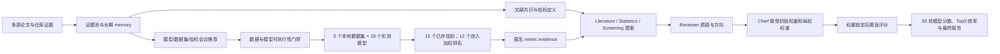

# AMP 多智能体 Benchmark：中间结果与关系梳理

更新时间：2026-07-27。本文只整理当前项目目录中已经落盘的真实产物，并区分“文献推荐”“实际执行”和“探索性决策”三种证据层级。

## 1. 一句话主线

项目先把多源文献压缩成可追溯的模型、数据集和指标候选；再对本地已经获得预测结果的 18 个模型、3 个数据集执行统一评估；最后由盲化的多 Agent 会议产生初始权重和 50 轮动态权重，在每轮权重锁定后才揭盲计算模型排名，输出稳定性排名、图和 Markdown 报告。

## 2. 各阶段的真实中间结果

### 阶段 A：文献检索与证据压缩

| 中间产物 | 当前结果 | 作用 | 下游去向 |
|---|---:|---|---|
| `evidence_pool.json` | 2,365 篇论文；304 个 evidence batches | 保存原始多源证据、论文、仓库与数据集线索 | 进入长期文献 memory 和 Agent 会议 |
| `compact_evidence_pool.json` | 2,361 篇论文；302 batches；241 个 chunk summaries | 把长证据压缩成可放入上下文的证据块 | 支撑会议和检索续跑 |
| `literature_deep_research_memory.json` | 累积 2,503 篇论文、495 个候选模型、945 个仓库、337 个数据集、114 个指标记录 | 跨运行保存候选、关系和历史决策 | 产生模型、数据集、指标候选 |

注意：`evidence_pool` 是一次证据快照，`literature_deep_research_memory` 是跨运行累积 memory，所以 2,365 与 2,503 不是同一统计口径。

### 阶段 B：文献会议筛选模型

| 结果 | 数值/内容 | 含义 |
|---|---|---|
| 唯一检索模型 | 487 | 文献会议评价采用的去重分母 |
| meeting-valid 模型 | 59（12.11%） | 科学身份与任务范围通过会议筛选 |
| 错检或越界 | 209（42.92%） | 非目标模型、概念或错误匹配 |
| 相关但暂不可部署 | 185（37.99%） | 有科学相关性，但代码、权重或运行条件不足 |
| 需人工复核 | 34（6.98%） | 证据不足或冲突 |
| 最终部署候选 | 20 | 10 个核心主榜 + 10 个扩展部署池 |

最终 20 个文献推荐模型依次为：AMPlify、AntiBP3、sAMPpred-GAT、AMP-BERT、AMPSorter、C_AMPs-predict、CalcAMP、iAMPCN、LMPred、MAPLE、iAMP-SeE、iAMP-bert、HMD-AMP、ACEP、PyAMPA、SGAC、panCleave、Co-AMPpred、CELA-MFP 和 DDM。

人工 gold audit 中，5 个有效模型全部保留、3 个无效模型全部排除，当前小型审计集上的 meeting precision、accuracy、MCC 均为 1.0；但 gold 集仅 8 个模型，不能把该结果解释成对全部 487 个检索对象的总体性能保证。

### 阶段 C：数据集推荐与正式门禁

| 中间结果 | 当前状态 |
|---|---|
| 数据集候选池 | 339 个：333 个文献候选 + 6 个本地已审计候选 |
| 文献会议 shortlist | StarPep、DRAMP+UniProt ABP、dbAMP-derived binary set |
| 正式三数据集策略 | **未生成**；状态为 `blocked_no_three_formally_eligible_meeting_datasets` |
| 已有本地实测数据集 | Veltri_test、C_AMPs-predict_test、ProteoGPT_all_predictions |

三个本地数据集是真实评估数据，但不是已经通过全部正式门禁的最终 benchmark 组合：

| 数据集 | 样本数 | AMP 数/比例 | 观测类型 | 主要未决问题 |
|---|---:|---:|---|---|
| Veltri_test | 1,203 | 614，51.04% | 近似平衡 | 独立性、版本、许可、SHA256、训练重叠与低同源性报告未闭环 |
| C_AMPs-predict_test | 59,311 | 1,038，1.75% | 严重不平衡 | 模型关联数据；不能对 C_AMPs-predict 本身直接称为独立外测 |
| ProteoGPT_all_predictions | 1,796 | 725，40.37% | 中度不平衡 | 类别长度分布不匹配，且独立性/训练重叠仍需审计 |
| 合计 | 62,310 | 2,377 | 三种不同 prevalence 场景 | 适合探索性敏感性分析，不足以支持最终确认性结论 |

### 阶段 D：统一模型评估

本地实际完成评估的是 18 个模型：`ai4amp`、`amPEPpy`、`ampir`、`amplify_bal`、`amplify_imb`、`AMPsorter`、`apex1.1`、`apin`、`ascan2`、`C_AMPs-predict`、`esm-AxP-GDL`、`HMD-AMP`、`iamp-ca2l`、`iampcn`、`lstm`、`macrel`、`pepnet_fast`、`pepnet_standard`。

文献推荐的 20 个模型与实际评估的 18 个模型并非同一集合。按当前名称精确归一化后，明确重合的是 AMPsorter、C_AMPs-predict、HMD-AMP 和 iampcn；其余实测项主要来自已有本地预测、历史实现或同模型变体。因此：

- 20 个是“文献证据驱动的部署候选”。
- 18 个是“当前已有可比较预测结果的实测队列”。
- 不能写成“文献会议推荐的 20 个模型中有 18 个完成评估”。

每个模型—数据集组合保存 15 个字段：ACC、Precision、Recall、Specificity、BalancedAccuracy、NPV、F1、MCC、AUROC、AUPRC、BrierScore、ECE、AUPRC-Lift、Threshold 和 Coverage。进入权重会议的是去除重复排序维度和非评分字段后的 12 个指标。

三个数据集上的代表性单项最优结果如下：

| 数据集 | AUPRC 最优 | MCC 最优 | 说明 |
|---|---|---|---|
| C_AMPs-predict_test | C_AMPs-predict，0.9316 | C_AMPs-predict，0.8786 | 模型关联数据，结果可能受数据来源关系影响 |
| Veltri_test | ascan2，0.9928 | ascan2，0.9228 | 平衡集上多个模型得分很高 |
| ProteoGPT_all_predictions | AMPsorter，0.9515 | AMPsorter，0.7704 | 模型关联数据，且存在类别长度分布问题 |

这些单数据集冠军不直接等于跨数据集最终 Top3；后者还考虑 50 轮数据集重采样、12 指标权重和排名稳定性。

### 阶段 E：盲化多 Agent 权重会议

#### E1. Agent 可见信息

`agent_evidence_bundle.json` 给权重 Agent 提供：

- 文献共识与 12 个指标定义；
- 三个匿名数据集的规模和阳性率；
- 每轮 bootstrap 数据集组合；
- 每个指标的 coverage、separation、consistency、consensus、uniqueness 和 committee support。

权重 Agent 看不到模型名称、模型分数、排行榜和 Top3。内部文件 `internal_bootstrap_plan.json` 保留真实数据集名称，用于权重锁定后的执行层评分。

#### E2. 五个角色及其关系

| 角色 | 主要输入 | 中间结果 | 与下一角色的关系 |
|---|---|---|---|
| Literature Agent | 文献共识、指标定义、匿名 evidence | 初始提案 + 50 轮提案 | 保持 AUPRC/MCC/Recall/Precision 的文献主轴 |
| Statistics Agent | 指标统计性质、冗余与校准信息 | 初始提案 + 50 轮提案 | 防止 ACC 或高度相关指标重复计权 |
| Screening Agent | AMP 漏检与湿实验假阳性代价 | 初始提案 + 50 轮提案 | 强调 Recall/Precision 的任务代价 |
| Reviewer Agent | 三专家提案 + 匿名 evidence | criticisms、required changes、方向调整 | 不直接产生最终权重，只向 Chief 提供审计压力 |
| Chief Agent | 三专家提案、Reviewer audit、上一轮权重 | 初始 accepted vector + 50 个 accepted vectors | 在约束内形成唯一可用于评分的权重 |

Chief 的实际协调逻辑是：先对三专家权重取均值，再乘以 `exp(0.12 × Reviewer direction)` 并归一化；从第 1 轮开始，新目标保留上一轮权重的 55%，吸收本轮审议结果的 45%。每个指标限制在 0.005–0.35，总和为 1，单轮 L1 变化不超过 0.30。

#### E3. 初始权重到第 50 轮权重

| 指标 | 初始权重 | 第 50 轮权重 | 变化 | 50 轮范围 |
|---|---:|---:|---:|---:|
| AUPRC | 0.2268 | 0.2083 | -0.0185 | 0.2053–0.2224 |
| MCC | 0.1847 | 0.1671 | -0.0176 | 0.1668–0.1814 |
| Recall | 0.1322 | 0.1334 | +0.0011 | 0.1318–0.1343 |
| Precision | 0.1025 | 0.1025 | 0.0000 | 0.1019–0.1035 |
| AUROC | 0.0644 | 0.0663 | +0.0020 | 0.0645–0.0671 |
| BalancedAccuracy | 0.0594 | 0.0610 | +0.0016 | 0.0595–0.0613 |
| F1-Score | 0.0556 | 0.0559 | +0.0004 | 0.0555–0.0564 |
| BrierScore | 0.0475 | 0.0538 | +0.0063 | 0.0486–0.0545 |
| Specificity | 0.0393 | 0.0459 | +0.0066 | 0.0408–0.0469 |
| ECE | 0.0389 | 0.0452 | +0.0063 | 0.0403–0.0463 |
| NPV | 0.0312 | 0.0385 | +0.0073 | 0.0324–0.0388 |
| ACC | 0.0176 | 0.0221 | +0.0045 | 0.0184–0.0225 |

关系解释：AUPRC 与 MCC 始终是主权重，但 Reviewer 对冗余、校准和负类行为的审计把一部分权重转移给 BrierScore、ECE、NPV 和 Specificity。权重没有发生剧烈跳变，说明 55% 历史共识保留和 L1 门禁发挥了稳定作用。

### 阶段 F：权重锁定后的模型评分与聚合

每一轮的顺序必须理解为：

1. bootstrap 抽取 3 个数据集（有放回）；
2. 生成匿名六维 metric evidence；
3. 三专家分别提出 12 维权重；
4. Reviewer 审计；
5. Chief 接受唯一权重向量；
6. **权重锁定后**，执行层才读取真实模型指标；
7. 每个指标先转成 0–1 的并列感知 percentile rank，BrierScore/ECE 方向反转；
8. 按本轮权重求加权平均，得到 18 个模型分数和本轮 Top3。

因此，权重 Agent 决定“怎样评价”，确定性 ranking engine 决定“谁得分更高”；两者在模型身份和分数可见性上隔离。

50 轮最终聚合结果：

| 最终名次 | 模型 | 中位综合分 | IQR | Top3 频率 | 解读 |
|---:|---|---:|---:|---:|---|
| 1 | pepnet_standard | 0.7389 | 0.0542 | 70% | 总体最高且波动较小 |
| 2 | amplify_imb | 0.7061 | 0.1791 | 66% | 表现强，但跨重采样波动明显更大 |
| 3 | C_AMPs-predict | 0.6974 | 0.0870 | 50% | 进入 Top3 的稳定性中等，需注意关联数据风险 |
| 4 | HMD-AMP | 0.6758 | 0.1268 | 30% | 接近 Top3，存在较大轮间变化 |
| 5 | amplify_bal | 0.6486 | 0.0456 | 16% | 分数稳定，但总体位置低于前三 |
| 6 | AMPsorter | 0.6251 | 0.2212 | 30% | 对数据集组成高度敏感 |

输出规模与完整性：50 个 round JSON、600 条 metric-round 权重记录、900 条 model-round 分数记录；18 个模型均保留，没有资源门禁排除。当前 18 个模型都缺少完整实测资源数据，因此被标记为 `eligible_missing_resource_measurement`，不是“资源门禁已证明合格”。

## 3. 文件之间的直接依赖关系

| 上游文件 | 生成/影响的下游文件 | 关系 |
|---|---|---|
| `data/evidence_pool.json` | `data/literature_deep_research_memory.json` | 原始证据进入长期 memory |
| `data/literature_deep_research_memory.json` | 模型 Top20、数据集 shortlist、指标方案 | 文献会议决策基础 |
| 三个 `results_manual/*/final_results_with_predictions.csv` | 三个 `eval_result.json` | 真实标签与模型概率生成统一指标 |
| 三个 `eval_result.json` + 文献共识 | `agent_evidence_bundle.json` | 构建匿名指标证据和 50 轮计划 |
| `agent_evidence_bundle.json` | 三个 expert proposal JSON | 三类专家独立产生初始及逐轮权重提案 |
| 三个 expert proposal JSON | `reviewer_agent_audit.json` | Reviewer 比较分歧、冗余和泄漏风险 |
| experts + Reviewer | `chief_initial_decision.json`、`rounds/round_*.json` | Chief 产生唯一可执行权重 |
| 每轮 accepted weights + 隐藏的真实指标 | `codex_agent_model_scores_50_rounds.csv` | 计算模型综合分与轮内名次 |
| 50 轮模型分数 | `codex_agent_model_ranking_50_rounds.csv` | 汇总中位分、IQR、平均名次和 Top3 频率 |
| 权重 CSV + 分数 CSV + ranking CSV | 箱线图/气泡图与 `amp_future_directions_report_codex_agents.md` | 论文展示和审计报告 |

## 4. 论文中应如何表述证据层级

- 可以说：系统完成了 18 个模型在 3 个本地数据集上的探索性统一评估，并通过盲化多 Agent 流程完成 50 轮指标权重敏感性分析。
- 可以说：pepnet_standard 在当前 50 轮分析中获得最高中位综合分和 70% Top3 频率。
- 不应说：文献 Agent 推荐的 20 个模型已经全部完成 benchmark。
- 不应说：三个当前数据集已经全部通过独立性、来源、低同源性和训练重叠门禁。
- 不应说：50 轮自适应权重产生了无泄漏的确认性测试排名。当前设计仍是 post-hoc exploratory analysis。
- 若要升级为正式主结论，需要在独立 development/validation evidence 上确定并冻结权重、阈值和数据集规则，再在通过来源与同源性门禁的独立测试集上一次性评估。

## 5. 最核心的关系结论

1. 文献层决定“应该考虑哪些模型、数据集和指标”，但不直接决定实测冠军。
2. 执行层产生真实模型概率和 15 个评估字段，其中 12 个非重复评分指标进入权重会议。
3. Agent 层只决定指标权重；在权重锁定之前不能看到模型身份和分数。
4. 排名层把每轮 accepted weights 应用于真实指标，因此最终结果同时受数据集重采样、指标权重和模型跨数据集稳定性影响。
5. 最终 Top3 是当前探索性证据下的稳定性排序，不等同于已完成独立验证的部署结论。
