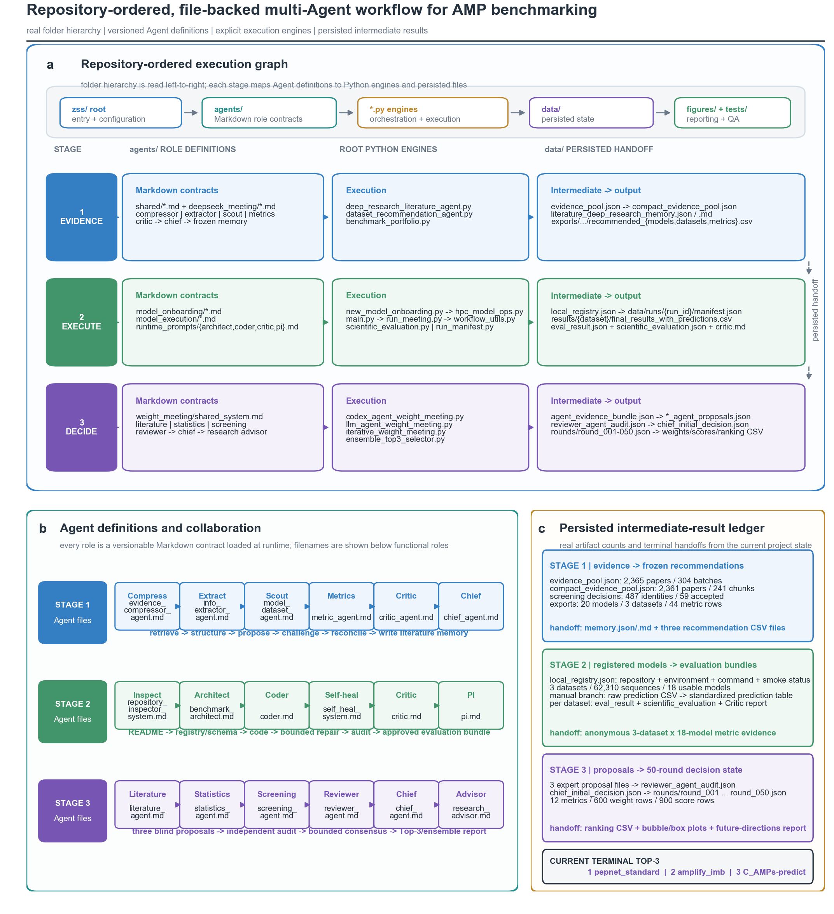
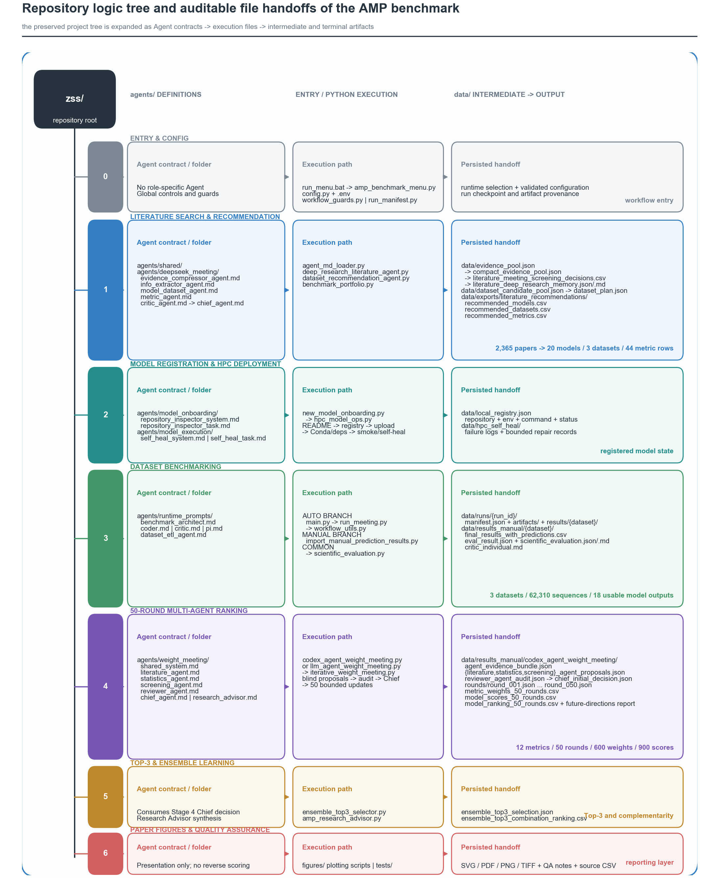
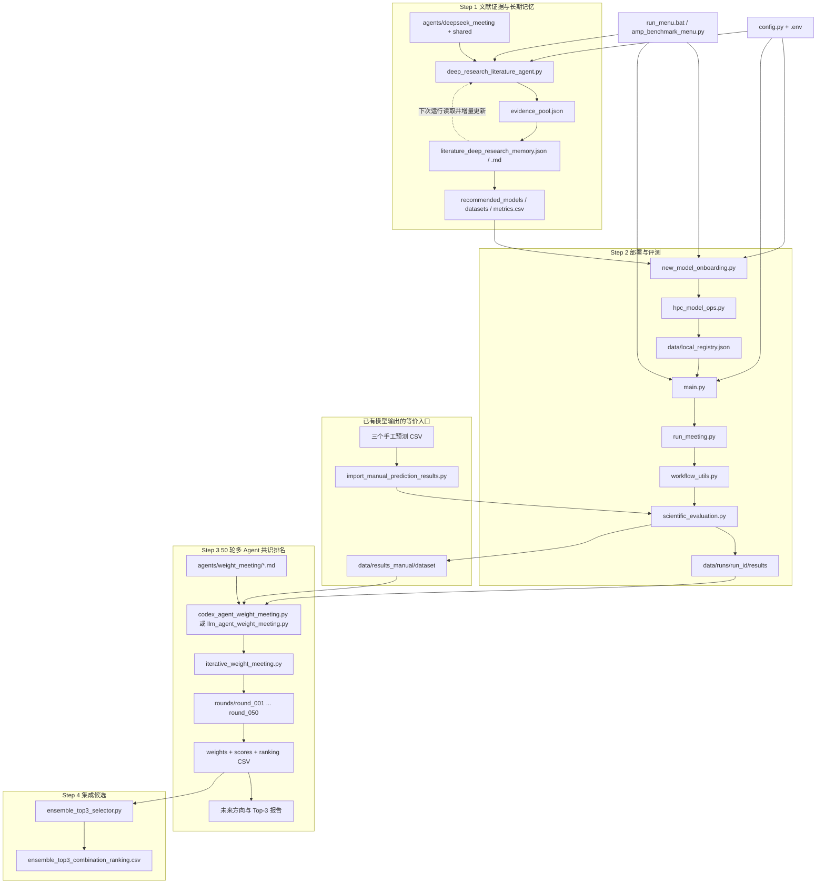

# AMP Benchmark 项目重点文件关系图

本文只描述当前项目中直接参与“文献检索 -> 模型部署 -> 数据集评测 -> 50 轮排名 -> 集成推荐”的重点文件。缓存、历史备份和大量绘图版本没有全部展开。

论文图版本位于 `figures/amp_project_folder_agent_trace_v3/`：

- `amp_project_folder_agent_trace_v3.svg`：可编辑文字与矢量框线，优先用于论文排版。
- `amp_project_folder_agent_trace_v3.pdf`：投稿与审稿预览版本。
- `amp_project_folder_agent_trace_v3.png`：300 dpi 快速预览。
- `amp_project_folder_agent_trace_v3.tiff`：600 dpi LZW 压缩投稿版本。
- `source_data_agent_definitions.csv`：图中 Agent 角色及 Markdown 定义文件。
- `source_data_folder_handoffs.csv`：Agent 文件、执行脚本与持久化结果之间的交接关系。
- `source_data_intermediate_artifacts.csv`：图中全部中间结果计数。



完整保留 0–6 级目录树的新版论文图位于 `figures/amp_project_logic_tree_v4/`，后续涉及“项目树状结构”的论文展示应优先使用该版本。



## 1. 核心文件树

```text
zss/
|
+-- 入口与全局配置
|   +-- run_menu.bat                     # Windows 菜单启动脚本
|   +-- amp_benchmark_menu.py            # 统一交互入口，分派检索、部署、评测和检查任务
|   +-- main.py                          # 自动化基准评测主流程
|   +-- config.py                        # 读取 .env、HPC、SLURM、模型和指标配置
|   +-- .env                             # 本机密钥与连接参数，不应提交或分享
|
+-- Step 1：文献检索、Agent 会议与长期记忆
|   +-- deep_research_literature_agent.py # 多源搜索、证据压缩、圆桌讨论和推荐生成
|   +-- literature_agent_evaluation.py    # 检查文献 Agent 输出质量
|   +-- benchmark_portfolio.py            # 从候选模型中构造正式评测组合
|   +-- dataset_recommendation_agent.py   # 形成数据集候选池和推荐方案
|   +-- agent_md_loader.py                # 加载 agents/ 下的 Markdown 提示词
|   +-- agents/
|   |   +-- deepseek_meeting/             # 文献会议各角色提示词
|   |   +-- pubmed_planner/               # PubMed 检索规划提示词
|   |   +-- shared/                       # 证据、完整性、指标和输出公共规则
|   |   +-- runtime_prompts/              # 自动评测阶段运行时 Agent 提示词
|   |   +-- model_onboarding/             # 新模型仓库分析提示词
|   |   +-- model_execution/              # 部署失败后的自愈提示词
|   |   `-- weight_meeting/               # 50 轮权重会议角色提示词
|   `-- data/
|       +-- evidence_pool.json            # 全量结构化证据池
|       +-- compact_evidence_pool.json    # 压缩后供会议使用的证据
|       +-- literature_deep_research_memory.json
|       +-- literature_deep_research_memory.md
|       |                                  # 跨次运行长期记忆，JSON 供程序读，MD 供人查看
|       +-- literature_deep_research_index.json
|       +-- dataset_candidate_pool.json   # 数据集候选池
|       +-- dataset_plan.json             # 最终数据集计划
|       `-- exports/literature_recommendations/
|           +-- recommended_models.csv
|           +-- recommended_datasets.csv
|           `-- recommended_metrics.csv
|
+-- Step 2A：新模型注册、上传和 HPC 环境部署
|   +-- new_model_onboarding.py           # 下载/复用仓库，分析 README，生成注册记录
|   +-- hpc_model_ops.py                  # 上传仓库、建 Conda 环境、补依赖、冒烟测试、自愈
|   +-- workflow_guards.py                # 部署和评测前的完整性检查
|   `-- data/local_registry.json          # 模型注册表，保存仓库、环境、命令和 HPC 状态
|
+-- Step 2B：自动评测主链
|   +-- main.py                           # 组织配置检查、会议、HPC 执行、评测和报告
|   +-- run_meeting.py                    # 第一次/第二次 Agent 会议，生成运行与清洗代码
|   +-- workflow_utils.py                 # 提取/校验生成代码，SLURM 等待，取回结果
|   +-- scientific_evaluation.py          # 统一计算 AUROC、AUPRC、MCC、BA、校准等指标
|   +-- run_manifest.py                   # 记录每次运行的输入、版本、事件、产物与校验和
|   +-- data/datasets/<dataset>/
|   |   +-- combined_test.fasta           # 模型输入序列
|   |   `-- ground_truth.csv              # 样本真值
|   `-- data/runs/<run_id>/
|       +-- manifest.json                 # 可复现运行清单
|       +-- artifacts/                    # 会议代码、日志和中间产物
|       `-- results/<dataset>/            # 各数据集正式评测结果
|
+-- Step 2C：已有预测结果续跑
|   +-- import_manual_prediction_results.py
|   |                                      # 导入外部/手工预测 CSV，并接入统一指标协议
|   +-- data/manual_predictions/<dataset>/ # 原始预测文件的归档副本
|   `-- data/results_manual/<dataset>/
|       +-- final_results_with_predictions.csv
|       +-- eval_result.json
|       +-- scientific_evaluation.json
|       +-- scientific_evaluation.md
|       `-- critic_individual.md
|
+-- Step 3：跨数据集 50 轮 Agent 排名
|   +-- codex_agent_weight_meeting.py      # 本地可复现的多角色 50 轮会议
|   +-- llm_agent_weight_meeting.py        # 调用真实 LLM 的 50 轮会议，可断点恢复
|   +-- iterative_weight_meeting.py        # 指标审查、权重约束、评分和聚合数学逻辑
|   +-- model_resource_policy.py           # 资源消耗与可部署性惩罚/筛选规则
|   `-- data/results_manual/codex_agent_weight_meeting/
|       +-- agent_evidence_bundle.json     # 脱敏后的会议证据包
|       +-- *_agent_proposals.json         # 文献、统计、筛选 Agent 的提案
|       +-- reviewer_agent_audit.json      # 独立审计结果
|       +-- chief_initial_decision.json    # Chief Agent 初始裁决
|       +-- rounds/round_001.json ...      # 每轮权重和决策轨迹
|       +-- codex_agent_metric_weights_50_rounds.csv
|       +-- codex_agent_model_scores_50_rounds.csv
|       +-- codex_agent_model_ranking_50_rounds.csv
|       `-- amp_future_directions_report_codex_agents.md
|
+-- Step 4：Top-3 与集成学习候选
|   +-- ensemble_top3_selector.py          # 根据跨数据集预测评估三模型组合
|   +-- amp_research_advisor.py            # 汇总性能、互补性和证据，生成研究建议报告
|   `-- data/results_manual/
|       +-- ensemble_top3_selection.json
|       `-- ensemble_top3_combination_ranking.csv
|
+-- 展示与质量保障
    +-- figures/                           # 论文图、SVG/PDF/TIFF 和制图脚本
    +-- build_filtered_cross_dataset_figure.py
    |                                      # 按筛选后模型重画跨数据集结果图
    +-- tests/                             # 文献记忆、数据门禁、评测、排名等单元测试
    +-- SCIENTIFIC_EVALUATION_PROTOCOL.md  # 指标协议说明
    `-- PROJECT_INTERMEDIATE_RESULTS_MAP.md# 更细的中间结果追踪说明
```

## 2. 真实调用与数据关系



## 3. 各层作用与边界

| 层 | 主要作用 | 权威输入 | 权威输出 |
|---|---|---|---|
| 文献层 | 找模型、数据集和指标，执行多角色讨论并保留长期记忆 | 检索缓存、论文元数据、上一版 memory | evidence pool、memory、推荐 CSV |
| 注册部署层 | 把“论文中的模型”变成“可在 HPC 运行的模型” | 推荐模型、README、代码仓库 | `local_registry.json`、HPC 环境与冒烟测试状态 |
| 自动评测层 | 生成模型运行/清洗代码并在 SLURM 上执行 | 注册表、FASTA、ground truth | `data/runs/<run_id>/results` 与 manifest |
| 手工导入层 | 让已在别处跑好的概率表跳过部署，直接进入同一评测协议 | 手工预测 CSV、ground truth | `data/results_manual/<dataset>` |
| 科学评测层 | 对标准预测表计算统一指标、置信区间和统计比较 | sample ID、label、probability | `scientific_evaluation.json/.md` |
| 排名会议层 | 多 Agent 审查证据、动态提议权重、审计并做 50 轮聚合 | 三个数据集的真实评测 JSON | 每轮记录、权重、模型得分、最终排名和报告 |
| 集成层 | 判断 Top-3 是否性能互补，并比较三模型组合 | 对齐后的逐样本预测和最终排名 | 组合排名与集成建议 |
| 展示层 | 将真实 CSV/JSON 转成论文图 | 评测与排名产物 | PNG、SVG、PDF、TIFF；不反向参与评分 |

## 4. 最关键的四类状态文件

1. `data/literature_deep_research_memory.json`：文献会议的机器可读长期记忆。它会被下一次检索读取，但不是不可修改的固定名单。
2. `data/local_registry.json`：模型能否运行的事实来源。仅“有模型名称”不代表已经部署成功，还要检查环境、推理命令和 smoke-test 字段。
3. `data/runs/<run_id>/manifest.json`：一次自动评测的可复现证据，记录模型、数据集、代码、HPC 与产物。
4. `data/results_manual/codex_agent_weight_meeting/rounds/*.json`：50 轮排名的完整过程证据，最终 CSV 只是这些轮次的聚合结果。

## 5. 修改需求时先找哪个文件

| 想修改的功能 | 优先查看 |
|---|---|
| 文献检索范围、模型/数据集推荐规则 | `deep_research_literature_agent.py`、`agents/deepseek_meeting/`、`agents/shared/` |
| 记忆是否继承、旧模型是否保留 | `deep_research_literature_agent.py`、`literature_deep_research_memory.json` |
| 新模型注册和自动部署 | `new_model_onboarding.py`、`hpc_model_ops.py`、`local_registry.json` |
| HPC/SLURM 运行、生成代码取回 | `main.py`、`run_meeting.py`、`workflow_utils.py` |
| 指标定义、阈值、置信区间 | `scientific_evaluation.py`、`SCIENTIFIC_EVALUATION_PROTOCOL.md` |
| 导入三个已有预测文件 | `import_manual_prediction_results.py` |
| 50 轮权重、Agent 角色和最终排名 | `codex_agent_weight_meeting.py`、`llm_agent_weight_meeting.py`、`iterative_weight_meeting.py`、`agents/weight_meeting/` |
| Top-3 组合和互补性 | `ensemble_top3_selector.py`、`amp_research_advisor.py` |
| 论文图样式或筛选后的模型展示 | `figures/`、`build_filtered_cross_dataset_figure.py` |

## 6. 使用时容易混淆的目录

- `data/results/`：历史或自动评测结果；是否属于当前正式运行要结合对应 manifest 判断。
- `data/results_manual/`：三个手工预测数据集及后续 50 轮会议的当前主要结果区。
- `data/vlab_discussions/`：LLM 会议记录、生成代码和勘探报告，属于可审计中间产物，不是注册表。
- `data/search_cache/`、`data/fulltext_cache/`、`data/chunk_summaries/`：用于加速文献检索，可以重建，不应当作最终推荐结果。
- `figures/`：展示产物；正式排名必须回溯到 CSV/JSON，不能从图片读取数值再评分。

## 7. Agent 定义文件与中间结果对照

| 阶段 | Agent 定义文件 | 关键中间结果 |
|---|---|---|
| 文献证据 | `agents/deepseek_meeting/evidence_compressor_agent.md`、`info_extractor_agent.md`、`model_dataset_agent.md`、`metric_agent.md`、`critic_agent.md`、`chief_agent.md` | `evidence_pool.json`、`compact_evidence_pool.json`、`literature_deep_research_memory.json/.md`、三个推荐 CSV |
| 部署评测 | `agents/model_onboarding/repository_inspector_system.md`、`agents/model_execution/self_heal_system.md`、`agents/runtime_prompts/benchmark_architect.md`、`coder.md`、`critic.md`、`pi.md` | `local_registry.json`、`manifest.json`、标准预测 CSV、`eval_result.json`、`scientific_evaluation.json`、Critic 报告 |
| 50 轮决策 | `agents/weight_meeting/literature_agent.md`、`statistics_agent.md`、`screening_agent.md`、`reviewer_agent.md`、`chief_agent.md`、`research_advisor.md` | 三份专家提案、Reviewer 审计、Chief 初始决策、50 个 round JSON、权重/得分/排名 CSV、研究报告 |
