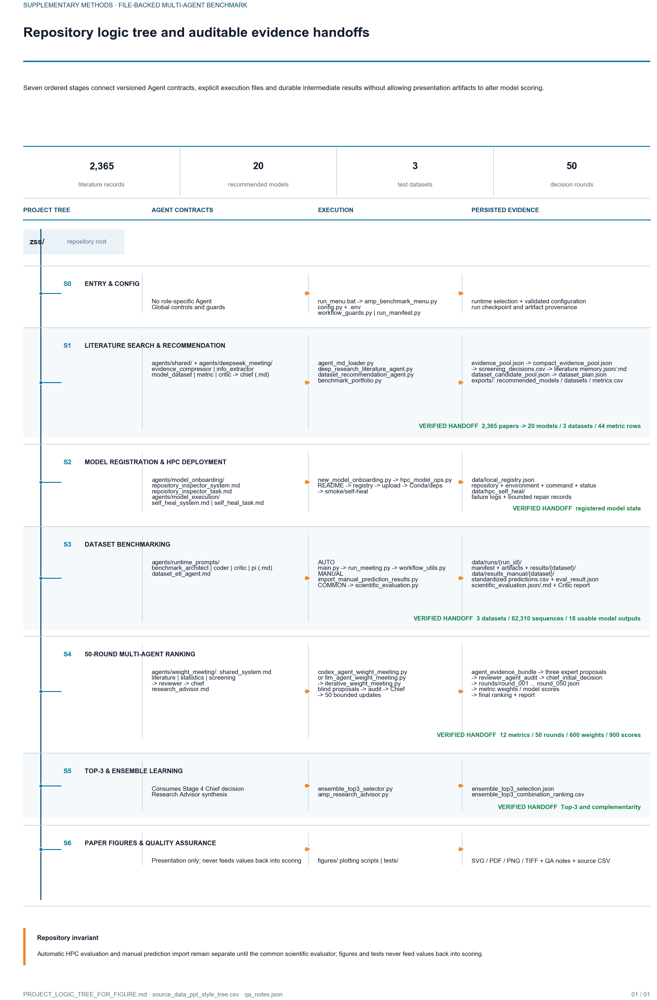

# AMP Benchmark 论文图片逻辑树

> 状态：已确认并保留。后续论文流程图以本文件为结构基础。
>
> 排列规则：文件夹 -> Agent 定义 -> 执行程序 -> 中间结果 -> 最终输出。

当前论文树状图版本：

- `figures/amp_project_logic_tree_v4/amp_project_logic_tree_v4.svg`：可编辑矢量版本。
- `figures/amp_project_logic_tree_v4/amp_project_logic_tree_v4.pdf`：论文排版版本。
- `figures/amp_project_logic_tree_v4/amp_project_logic_tree_v4.png`：300 dpi 预览。
- `figures/amp_project_logic_tree_v4/amp_project_logic_tree_v4.tiff`：600 dpi 投稿版本。


参考 A4 补充方法页视觉规范制作的版本：

- `figures/amp_project_logic_tree_ppt_style_v5/amp_project_logic_tree_ppt_style_v5.svg`
- `figures/amp_project_logic_tree_ppt_style_v5/amp_project_logic_tree_ppt_style_v5.pdf`
- `figures/amp_project_logic_tree_ppt_style_v5/amp_project_logic_tree_ppt_style_v5.png`
- `figures/amp_project_logic_tree_ppt_style_v5/amp_project_logic_tree_ppt_style_v5.tiff`



```text
zss/
|
+-- 0. 项目入口与配置
|   +-- run_menu.bat
|   +-- amp_benchmark_menu.py
|   +-- config.py
|   +-- .env
|   +-- workflow_guards.py
|   `-- run_manifest.py
|
+-- 1. 文献搜索与模型推荐
|   |
|   +-- Agent 定义：agents/
|   |   +-- shared/
|   |   `-- deepseek_meeting/
|   |       +-- evidence_compressor_agent.md
|   |       +-- info_extractor_agent.md
|   |       +-- model_dataset_agent.md
|   |       +-- metric_agent.md
|   |       +-- critic_agent.md
|   |       `-- chief_agent.md
|   |
|   +-- 执行程序
|   |   +-- agent_md_loader.py
|   |   +-- deep_research_literature_agent.py
|   |   +-- dataset_recommendation_agent.py
|   |   `-- benchmark_portfolio.py
|   |
|   `-- 中间结果：data/
|       +-- evidence_pool.json
|       +-- compact_evidence_pool.json
|       +-- literature_meeting_screening_decisions.csv
|       +-- literature_deep_research_memory.json
|       +-- literature_deep_research_memory.md
|       +-- dataset_candidate_pool.json
|       +-- dataset_plan.json
|       `-- exports/literature_recommendations/
|           +-- recommended_models.csv
|           +-- recommended_datasets.csv
|           `-- recommended_metrics.csv
|
+-- 2. 模型注册与 HPC 部署
|   |
|   +-- Agent 定义：agents/
|   |   +-- model_onboarding/
|   |   |   +-- repository_inspector_system.md
|   |   |   `-- repository_inspector_task.md
|   |   `-- model_execution/
|   |       +-- self_heal_system.md
|   |       `-- self_heal_task.md
|   |
|   +-- 执行程序
|   |   +-- new_model_onboarding.py
|   |   `-- hpc_model_ops.py
|   |
|   `-- 中间结果
|       +-- data/local_registry.json
|       `-- data/hpc_self_heal/
|
+-- 3. 数据集评测
|   |
|   +-- Agent 定义：agents/runtime_prompts/
|   |   +-- benchmark_architect.md
|   |   +-- coder.md
|   |   +-- critic.md
|   |   +-- pi.md
|   |   `-- dataset_etl_agent.md
|   |
|   +-- 自动评测分支
|   |   +-- main.py
|   |   +-- run_meeting.py
|   |   `-- workflow_utils.py
|   |
|   +-- 手工预测导入分支
|   |   `-- import_manual_prediction_results.py
|   |
|   +-- 两条分支共同进入
|   |   `-- scientific_evaluation.py
|   |
|   `-- 评测结果
|       +-- data/runs/<run_id>/
|       |   +-- manifest.json
|       |   +-- artifacts/
|       |   `-- results/<dataset>/
|       `-- data/results_manual/<dataset>/
|           +-- final_results_with_predictions.csv
|           +-- eval_result.json
|           +-- scientific_evaluation.json
|           +-- scientific_evaluation.md
|           `-- critic_individual.md
|
+-- 4. 50 轮多 Agent 排名
|   |
|   +-- Agent 定义：agents/weight_meeting/
|   |   +-- shared_system.md
|   |   +-- literature_agent.md
|   |   +-- statistics_agent.md
|   |   +-- screening_agent.md
|   |   +-- reviewer_agent.md
|   |   +-- chief_agent.md
|   |   `-- research_advisor.md
|   |
|   +-- 执行程序
|   |   +-- codex_agent_weight_meeting.py
|   |   +-- llm_agent_weight_meeting.py
|   |   `-- iterative_weight_meeting.py
|   |
|   `-- 中间与最终结果
|       `-- data/results_manual/codex_agent_weight_meeting/
|           +-- agent_evidence_bundle.json
|           +-- literature_agent_proposals.json
|           +-- statistics_agent_proposals.json
|           +-- screening_agent_proposals.json
|           +-- reviewer_agent_audit.json
|           +-- chief_initial_decision.json
|           +-- rounds/
|           |   +-- round_001.json
|           |   +-- ...
|           |   `-- round_050.json
|           +-- codex_agent_metric_weights_50_rounds.csv
|           +-- codex_agent_model_scores_50_rounds.csv
|           +-- codex_agent_model_ranking_50_rounds.csv
|           `-- amp_future_directions_report_codex_agents.md
|
+-- 5. Top-3 与集成学习
|   +-- ensemble_top3_selector.py
|   +-- amp_research_advisor.py
|   `-- data/results_manual/
|       +-- ensemble_top3_selection.json
|       `-- ensemble_top3_combination_ranking.csv
|
`-- 6. 论文图与质量检查
    +-- figures/
    +-- tests/
    +-- PROJECT_KEY_FILE_TREE.md
    `-- PROJECT_LOGIC_TREE_FOR_FIGURE.md
```

## 主数据流

```text
agents/*.md
    -> agent_md_loader.py
    -> 各阶段 Python 执行程序
    -> data/ 中的 JSON、CSV 和 Markdown 中间结果
    -> 下一阶段 Agent 读取
    -> 最终模型排名、Top-3 和集成学习报告
```

## 制图保留要求

1. 保留六个一级阶段，不合并文献搜索、部署、评测和排名。
2. 保留自动评测与手工预测导入两条分支。
3. Agent Markdown 定义文件必须与 Python 执行文件分列展示。
4. `data/` 中间结果必须作为独立证据层展示。
5. 50 个 round JSON、三类专家提案、Reviewer 审计和 Chief 决策不能省略。
6. `figures/` 只作为展示层，不能画成模型评分的数据来源。

## 分阶段论文图片

项目逻辑树同时拆分为七张独立的 A4 纵向论文图片：

1. `figures/amp_project_stage_pages_ppt_style_v6/stage0_entry_config.*`
2. `figures/amp_project_stage_pages_ppt_style_v6/stage1_literature_recommendation.*`
3. `figures/amp_project_stage_pages_ppt_style_v6/stage2_model_deployment.*`
4. `figures/amp_project_stage_pages_ppt_style_v6/stage3_dataset_benchmarking.*`
5. `figures/amp_project_stage_pages_ppt_style_v6/stage4_fifty_round_ranking.*`
6. `figures/amp_project_stage_pages_ppt_style_v6/stage5_top3_ensemble.*`
7. `figures/amp_project_stage_pages_ppt_style_v6/stage6_figures_quality_assurance.*`

每个阶段均提供 PNG、SVG 和 PDF；七页合并版为
`figures/amp_project_stage_pages_ppt_style_v6/amp_project_stage_pages_ppt_style_v6.pdf`。

## Agent Prompt 论文图册

参考补充材料中的 Prompt 档案页风格，项目的真实 Agent 指令和核验输出拆分为五张 A4 图片：

1. `figures/amp_project_prompt_atlas_ppt_style_v7/part1_literature_meeting.*`
2. `figures/amp_project_prompt_atlas_ppt_style_v7/part2_onboarding_self_heal.*`
3. `figures/amp_project_prompt_atlas_ppt_style_v7/part3_benchmark_evaluation.*`
4. `figures/amp_project_prompt_atlas_ppt_style_v7/part4_fifty_round_ranking.*`
5. `figures/amp_project_prompt_atlas_ppt_style_v7/part5_ensemble_reporting.*`

全部 Prompt 记录及来源保存在
`figures/amp_project_prompt_atlas_ppt_style_v7/amp_project_prompt_atlas_source.csv`，合并版为
`figures/amp_project_prompt_atlas_ppt_style_v7/amp_project_prompt_atlas_ppt_style_v7.pdf`。

### 三流程紧凑版

放大字体并减少留白后的三流程版本位于：

1. `figures/amp_project_prompt_atlas_3flows_v8/flow1_literature_memory.*`
2. `figures/amp_project_prompt_atlas_3flows_v8/flow2_deployment_evaluation.*`
3. `figures/amp_project_prompt_atlas_3flows_v8/flow3_ranking_ensemble.*`

三页合并 PDF：`figures/amp_project_prompt_atlas_3flows_v8/amp_project_prompt_atlas_3flows_v8.pdf`。

## 代表性人机交互图

双栏对话式论文图片位于
`figures/representative_amp_agent_interactions_v9/representative_amp_agent_interactions_v9.*`，
展示文献证据与记忆流程，以及真实 50 轮排名和 Top-3 集成选择。
