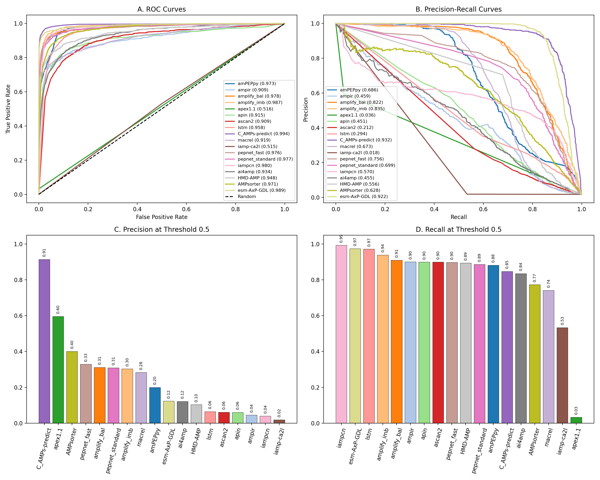
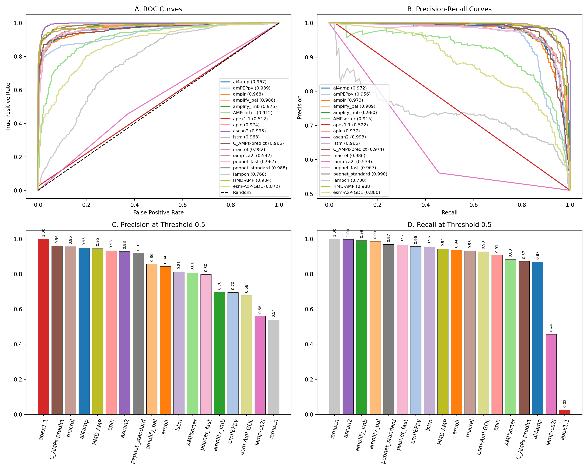
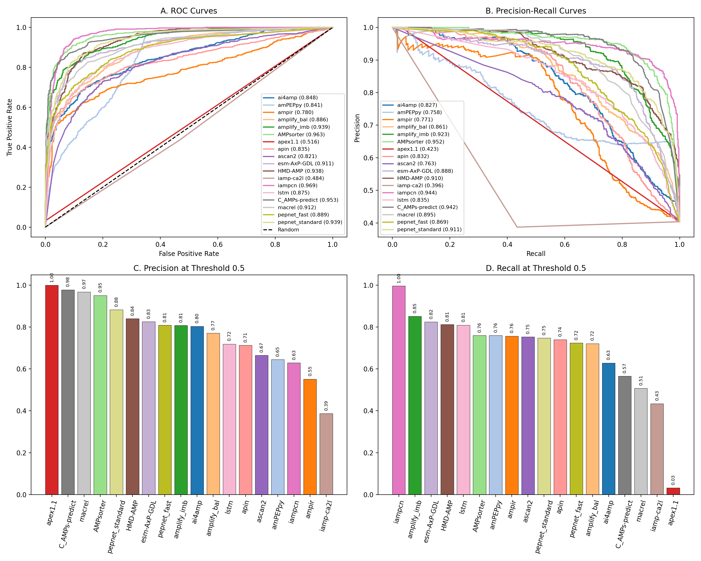

# 证据驱动的多 Agent AMP 基准评测专业报告

## 执行摘要

本项目以可追溯的三阶段 Human–Agent 工作流，将文献证据转化为可执行的 AMP 模型基准，并进一步通过 50 轮盲化权重会议形成模型排序。当前规范结果中，**pepnet_standard** 的中位加权秩分数最高；Top‑3 为 **pepnet_standard、amplify_imb、C_AMPs-predict**。建议优先进行概率软投票或秩平均；只有在独立验证集上训练的 stacking 才可作为后续方案。

> 结论边界：Stage 3 的权重 Agent 在模型名称与模型分数揭盲前完成权重选择，但三套数据仍存在来源、独立性和同源性审计缺口；现有结果来自 stored test-like predictions。因此本报告支持探索性比较、系统审计和后续验证设计，不构成无泄漏、预注册的正式 benchmark 声明。

## 1. 报告对象与真实证据链

本报告仅整合当前工作区已经存在的输入、Agent 对话、结构化中间产物、评测文件和 50 轮结果，不补造缺失实验。规范证据链为：

1. **Stage 1 — 文献会议：** 多源检索 → 证据压缩 → 模型/数据集/指标提案 → Critic 质询 → Chief 冻结。
2. **Stage 2 — 自动部署与评测：** 真实预测表/FASTA → schema 对齐 → 代码生成与复核 → 三数据集统一评测。
3. **Stage 3 — 盲化权重会议：** 角色化指标提案 → Reviewer 审计 → Chief 有界更新 50 轮 → 揭盲排名 → Top‑3 集成建议。

## 2. Stage 1：文献检索、资产推荐与证据会议

### 2.1 真实输入

| 输入对象 | 实际内容 | 机器可读来源 |
|---|---|---|
| 科学任务 | AMP 二分类；兼顾模型、数据集、指标、代码/权重和算力约束 | [literature_deep_research_memory.json](../../../data/literature_deep_research_memory.json) |
| 检索计划 | 80 个存储 query plans（crossref=11, datacite=6, europe_pmc=17, github=10, openalex=0, pubmed=26, semantic_scholar=4, zenodo=6） | [multi_source_search_summary.json](../../../data/multi_source_search_summary.json) |
| 证据池 | 2361 篇文献；241 个压缩证据单元 | [compact_evidence_pool.json](../../../data/compact_evidence_pool.json) |
| 冻结筛选集 | 487 个模型身份；59 个通过；20 个进入部署优先池 | [literature_meeting_screening_decisions.csv](../../../data/literature_meeting_screening_decisions.csv) |

### 2.2 Stage 1 每个 Agent 的真实输入与输出

| Agent | 真实输入 | Prompt / 决策契约 | 实际输出 | 输出文件 |
|---|---|---|---|---|
| Query Planner | 人类研究问题、AMP 二分类范围、来源与计算约束 | 拆分高召回、高精度、架构、数据集、代码/权重等检索意图；保留可复现 query | 多来源检索计划 | [pubmed_query_planner.md](../../../agents/pubmed_planner/pubmed_query_planner.md)；[search summary](../../../data/multi_source_search_summary.json) |
| Search / Info Extractor | query plans、API/仓库返回、文献元数据与全文 | 提取模型身份、任务、代码、权重、数据集、指标和证据锚点；不把搜索命中当作已验证证据 | 原始 evidence pool、结构化论文/仓库/数据集记录 | [info_extractor_agent.md](../../../agents/deepseek_meeting/info_extractor_agent.md)；[evidence_pool.json](../../../data/evidence_pool.json) |
| Evidence Compressor | 原始检索记录、全文片段、仓库与数据集线索 | 仅压缩输入 chunk；不虚构 PMID/DOI/URL；输出严格 JSON 和可追溯摘要 | compact evidence pool | [evidence_compressor_agent.md](../../../agents/deepseek_meeting/evidence_compressor_agent.md)；[compact_evidence_pool.md](../../../data/compact_evidence_pool.md) |
| Scout / Model–Dataset Agent | compact evidence、历史 memory、模型与数据集实体 | 召回完整候选池；按任务同一性、代码/权重、可部署性、证据等级和架构覆盖提出保留/搁置 | 模型/数据集提案；冻结筛选链 487 → 59 → 20 | [model_dataset_agent.md](../../../agents/deepseek_meeting/model_dataset_agent.md)；[screening decisions](../../../data/literature_meeting_screening_decisions.csv) |
| Dataset Selection Agent | 文献 shortlist、339 个候选、6 个真实 CSV 审计结果 | 约束选择 1 个 balanced + 2 个不同不平衡程度的数据集；同时保留 formal blockers | 3 个经验互补评测 profile；正式资格仍 blocked | [dataset_agent_recommendation.md](../../../data/dataset_agent_recommendation.md)；[dataset_agent_recommendation.json](../../../data/dataset_agent_recommendation.json) |
| Metrics Agent | compact evidence、数据集 prevalence、漏检/误检代价 | 预定义 endpoint hierarchy、验证集阈值、校准、效用、资源和统计报告规则 | AUPRC 主终点、MCC 关键次终点及完整指标协议 | [metric_agent.md](../../../agents/deepseek_meeting/metric_agent.md)；[literature memory](../../../data/literature_deep_research_memory.md) |
| Critic Agent | Scout 与 Metrics 提案、来源/身份/代码/泄漏信息 | 对每项作 accept / reject / defer；挑战身份、代码、权重、阈值、独立性和同源性 | 质询、否决/暂缓理由和补证要求 | [critic_agent.md](../../../agents/deepseek_meeting/critic_agent.md)；[meeting_trace.md](../../../data/meeting_trace.md) |
| Chief Agent | Scout/Metrics 提案、Critic 审计、rebuttal 与历史 memory | 调和冲突、保留 dissent、冻结可审计 memory；不删除未解决 blocker | 20 模型优先池、3 个经验评测数据集、冻结指标协议与长期记忆 | [chief_agent.md](../../../agents/deepseek_meeting/chief_agent.md)；[literature_deep_research_memory.md](../../../data/literature_deep_research_memory.md) |

**Human checkpoint：** 人类提供研究范围和算力边界，授权在线检索、代码/数据获取与高风险缺口的人工核验；Agent 不替代数据许可、训练重叠和同源性审计的最终责任。

### 2.3 冻结的模型优先池（n=20）

| Rank | Model | Benchmark role | Year | Evidence / code status |
|---:|---|---|---:|---|
| 1 | AMPlify | 经典基线 | 2022 | fulltext; repository recorded |
| 2 | AntiBP3 | 架构代表 | 2024 | fulltext; repository recorded |
| 3 | sAMPpred-GAT | 架构代表 | 2023 | abstract; repository recorded |
| 4 | AMP-BERT | 架构代表 | 2023 | fulltext; repository recorded |
| 5 | AMPSorter | 已核验核心候选 | 2025 | primary_publisher_crossref_openalex_github_verified; repository recorded |
| 6 | C_AMPs-predict | 已核验核心候选 | 2022 | primary_publisher_crossref_openalex_github_verified; repository recorded |
| 7 | CalcAMP | 证据排序补位 | 2023 | fulltext; repository recorded |
| 8 | iAMPCN | 架构代表 | 2023 | fulltext; repository recorded |
| 9 | LMPred | 证据排序补位 | 2022 | fulltext; repository recorded |
| 10 | MAPLE | 证据排序补位 | 2025 | fulltext; repository recorded |
| 11 | iAMP-SeE | 证据排序补位 | 2026 | fulltext; repository recorded |
| 12 | iAMP-bert | 证据排序补位 | 2024 | fulltext; repository recorded |
| 13 | HMD-AMP | 已核验核心候选 | 2026 | primary_publisher_crossref_openalex_github_verified; repository recorded |
| 14 | ACEP | 证据排序补位 | 2020 | fulltext; repository recorded |
| 15 | PyAMPA | 证据排序补位 | 2024 | fulltext; repository recorded |
| 16 | SGAC |  | 2026 | fulltext; repository recorded |
| 17 | panCleave |  | 2023 | fulltext; repository recorded |
| 18 | Co-AMPpred | classic_baseline | 2021 | fulltext; repository recorded |
| 19 | CELA-MFP |  | 2024 | fulltext; repository recorded |
| 20 | DDM |  | 2026 | fulltext; repository recorded |

### 2.4 经验互补数据集与冻结指标协议

| Dataset | n | Positive / negative | Prevalence | Profile | Formal status |
|---|---:|---:|---:|---|---|
| Veltri_test | 1,203 | 614 / 589 | 51.04% | balanced | blocked pending provenance / independence / homology gates |
| C_AMPs-predict_test | 59,311 | 1038 / 58273 | 1.75% | imbalanced | blocked pending provenance / independence / homology gates |
| ProteoGPT_all_predictions | 1,796 | 725 / 1071 | 40.37% | imbalanced | blocked pending provenance / independence / homology gates |

**Literature-meeting endpoint hierarchy：** AUPRC 为唯一主终点；MCC 为关键次终点。探索性四指标权重为 AUPRC 0.35、MCC 0.30、Recall 0.20、Precision 0.15。正式阈值必须在独立验证集上用 Max‑MCC 选择后冻结；0.5 仅作诊断；测试集禁止调阈值。

## 3. Stage 2：自动部署、代码复核与统一评测

### 3.1 真实输入

20 个文献优先模型进入部署尝试；当前规范评测结果覆盖 **18 个成功形成有效概率输出的模型 × 3 个数据集**。输入包括真实 FASTA/预测表、模型 registry、仓库 README/requirements、统一 ID/sequence/probability schema、HPC 路径与运行 manifest。

### 3.2 Stage 2 每个 Agent 的真实输入与输出

| Agent | 真实输入 | 实际决策 / 响应 | 实际输出 | 输出文件 |
|---|---|---|---|---|
| PI Agent（模型运行会议） | 模型仓库、任务约束、预期输入输出和 HPC 环境 | 冻结部署要求、失败边界、概率输出接口和不得静默吞错的规则 | Code Engineer 的执行规格 | [meeting_stage1_model_run.md](../../../data/vlab_discussions/meeting_stage1_model_run.md) |
| Code Engineer | PI 规格、仓库 README、依赖和模型入口 | 生成/修订模型运行与结果收集代码 | 可执行 model runner、cache 与运行上下文 | [stage1_model_runner.py](../../../data/vlab_discussions/stage1_model_runner.py)；[stage1 context](../../../data/vlab_discussions/stage1_context_for_stage2.txt) |
| Data Architect Agent | 三套真实预测文件、ground truth、模型概率列 | 定义 ID/sequence/label/probability schema、路径映射、去重和缺失处理 | 评测数据契约与代码生成上下文 | [meeting_stage2_eval_codegen.md](../../../data/vlab_discussions/meeting_stage2_eval_codegen.md) |
| MLOps Coder V1 | Data Architect schema + PI 硬性要求 | 生成首版评测脚本 | V1 代码候选，进入独立 review | [stage2_eval_codegen.json](../../../data/vlab_discussions/meeting_stage2_eval_codegen.json) |
| Data Architect Reviewer | V1 代码、真实文件模式和错误路径 | 指出 FileNotFoundError、NaN、结果表安全性等缺陷并要求有界修复 | 可执行的修订清单 | [review transcript](../../../data/vlab_discussions/meeting_stage2_eval_codegen.md) |
| PI Summary Agent | V1、Reviewer 质询和实验纪律 | 将反馈压缩成不得越界的最终实现合同 | Final coder 的 bounded revision specification | [PI summary transcript](../../../data/vlab_discussions/meeting_stage2_eval_codegen.md) |
| MLOps Coder Final | V1 + review + PI summary | 完成防御性 schema 对齐、指标计算、ROC/PR、校准和结构化导出 | `stage2_eval_script.py`；每数据集 CSV/JSON/PNG/MD | [stage2_eval_script.py](../../../data/vlab_discussions/stage2_eval_script.py) |
| Per-dataset Critic | 评测指标、曲线、覆盖率、阈值来源和 manifest | 独立检查异常表现、解释风险和不可直接宣称的结论 | 每个数据集的 `critic_individual.md` | [C_AMPs Critic](../../../data/results_manual/C_AMPs-predict_test/critic_individual.md)；[Veltri Critic](../../../data/results_manual/Veltri_test/critic_individual.md)；[ProteoGPT Critic](../../../data/results_manual/ProteoGPT_all_predictions/critic_individual.md) |

**Human checkpoint：** 人类确认 registry/schema，授权必要的手动 CSV 上传与失败模型检查；只有通过环境与 smoke-test gate 的模型进入正式汇总。

### 3.3 三套数据集的真实评测输出

统一 Scientific Evaluation Protocol v2.0：主终点 AUPRC、关键次终点 MCC；缺少独立验证集时阈值 0.5 仅作诊断；当前 bootstrap iterations=0；成对阈值错误比较使用 McNemar，并对 pairwise family 采用 Holm 校正。

| Dataset | n | Prevalence | Evaluated models | Highest AUPRC | Highest MCC | Real artifacts |
|---|---:|---:|---:|---|---|---|
| C_AMPs-predict_test | 59,311 | 1.75% | 18 | C_AMPs-predict (0.932) | C_AMPs-predict (0.879) | [JSON](../../../data/results_manual/C_AMPs-predict_test/scientific_evaluation.json) · [MD](../../../data/results_manual/C_AMPs-predict_test/scientific_evaluation.md) · [CSV](../../../data/results_manual/C_AMPs-predict_test/final_results_with_predictions.csv) · [PNG](../../../data/results_manual/C_AMPs-predict_test/evaluation_curves.png) |
| Veltri_test | 1,203 | 51.04% | 18 | ascan2 (0.993) | ascan2 (0.923) | [JSON](../../../data/results_manual/Veltri_test/scientific_evaluation.json) · [MD](../../../data/results_manual/Veltri_test/scientific_evaluation.md) · [CSV](../../../data/results_manual/Veltri_test/final_results_with_predictions.csv) · [PNG](../../../data/results_manual/Veltri_test/evaluation_curves.png) |
| ProteoGPT_all_predictions | 1,796 | 40.37% | 18 | AMPsorter (0.952) | AMPsorter (0.770) | [JSON](../../../data/results_manual/ProteoGPT_all_predictions/scientific_evaluation.json) · [MD](../../../data/results_manual/ProteoGPT_all_predictions/scientific_evaluation.md) · [CSV](../../../data/results_manual/ProteoGPT_all_predictions/final_results_with_predictions.csv) · [PNG](../../../data/results_manual/ProteoGPT_all_predictions/evaluation_curves.png) |

#### C_AMPs-predict_test

#### Veltri_test

#### ProteoGPT_all_predictions

## 4. Stage 3：50 轮盲化多 Agent 权重会议与模型排序

### 4.1 真实输入与盲化设计

输入为 3 个匿名数据集 × 18 个匿名模型 × 12 个可用指标的 `agent_evidence_bundle.json`，以及预生成的 50 轮 bootstrap dataset plan。权重 Agent 只接触指标覆盖度、分离度、一致性、共识度、冗余性和任务代价等摘要；Chief 接受权重后，执行层才把权重应用到隐藏模型分数。

### 4.2 Stage 3 每个 Agent 的真实输入与输出

| Agent | 真实输入 | Prompt / 角色约束 | 实际输出 | 输出文件 |
|---|---|---|---|---|
| Literature Agent | 盲化 metric evidence + 文献 endpoint prior | 强调不平衡任务、文献可解释性和已冻结 endpoint hierarchy；不可读取模型身份 | initial + 50 轮权重提案及文字理由 | [literature_agent_proposals.json](literature_agent_proposals.json) |
| Statistics Agent | coverage、separation、consistency、consensus、uniqueness、committee support | 惩罚冗余、缺失和不稳定指标；保证统计可辨识性 | initial + 50 轮统计质量调整后的权重提案 | [statistics_agent_proposals.json](statistics_agent_proposals.json) |
| Screening Agent | FN/FP 成本、Recall/Precision、AUPRC、calibration 的盲化摘要 | 以 AMP 筛选效用平衡漏检和湿实验假阳性成本 | initial + 50 轮 cost-aware 权重提案 | [screening_agent_proposals.json](screening_agent_proposals.json) |
| Reviewer Agent | 三个专家提案 + 同一盲化 evidence bundle | 独立审查权重范围、方向、重复计权和证据不足；不直接给模型排名 | initial + 50 轮 audit、修正方向与边界 | [reviewer_agent_audit.json](reviewer_agent_audit.json) |
| Chief Agent | 专家提案、Reviewer audit、上一轮 accepted vector | 强制每项权重 [0.005, 0.35]、总和=1、单轮 L1 变化≤0.30；调和而非覆盖 dissent | initial decision、50 个 round JSON、最终 accepted weights | [chief_initial_decision.json](chief_initial_decision.json)；[rounds/](rounds) |
| Deterministic ranking engine | Chief 已接受权重 + 揭盲后的真实模型指标 | 不再改权重；对每轮统一计算加权 percentile rank | 900 条 model-round scores、完整 ranking 和 publication figures | [model scores CSV](codex_agent_model_scores_50_rounds.csv)；[ranking CSV](codex_agent_model_ranking_50_rounds.csv) |

**Human checkpoint：** 人类检查失败模式、数据泄漏风险与最终集成方案；不得依据测试集表现调 stacking、阈值或模型权重。

### 4.3 运行完整性

- Round files：**50**。
- Model-round score rows：**900**。
- Metric-weight rows：**600**。
- 所有评测行纳入：**True**；排除行：**0**。
- 权重约束通过：**True**；L1 变化约束通过：**True**。

### 4.4 接受的指标权重共识

| Metric | Initial Chief weight | Round-50 weight | 50-round median |
|---|---:|---:|---:|
| AUPRC | 0.226809 | 0.208301 | 0.207657 |
| MCC | 0.184663 | 0.167108 | 0.167337 |
| Recall | 0.132240 | 0.133358 | 0.133176 |
| Precision | 0.102500 | 0.102471 | 0.102683 |
| AUROC | 0.064384 | 0.066344 | 0.066466 |
| BalancedAccuracy | 0.059401 | 0.061008 | 0.060899 |
| F1-Score | 0.055569 | 0.055921 | 0.055978 |
| BrierScore | 0.047478 | 0.053813 | 0.053842 |
| Specificity | 0.039291 | 0.045888 | 0.045959 |
| ECE | 0.038871 | 0.045170 | 0.045335 |
| NPV | 0.031156 | 0.038475 | 0.038236 |
| ACC | 0.017638 | 0.022143 | 0.022175 |

### 4.5 50 轮模型排名

| Rank | Model | Median score | Score IQR | Mean rank | Top-3 frequency |
|---:|---|---:|---:|---:|---:|
| 1 | pepnet_standard | 0.738863 | 0.054227 | 2.68 | 70.0% |
| 2 | amplify_imb | 0.706146 | 0.179082 | 3.58 | 66.0% |
| 3 | C_AMPs-predict | 0.697374 | 0.086996 | 3.86 | 50.0% |
| 4 | HMD-AMP | 0.675815 | 0.126756 | 4.54 | 30.0% |
| 5 | amplify_bal | 0.648560 | 0.045647 | 5.74 | 16.0% |
| 6 | AMPsorter | 0.625123 | 0.221239 | 6.04 | 30.0% |
| 7 | pepnet_fast | 0.596353 | 0.104877 | 7.42 | 0.0% |
| 8 | macrel | 0.592317 | 0.147439 | 7.10 | 0.0% |
| 9 | esm-AxP-GDL | 0.542104 | 0.300570 | 8.82 | 12.0% |
| 10 | ascan2 | 0.491793 | 0.382764 | 9.66 | 26.0% |
| 11 | lstm | 0.439487 | 0.030397 | 11.74 | 0.0% |
| 12 | ai4amp | 0.430937 | 0.092749 | 12.00 | 0.0% |
| 13 | iampcn | 0.429798 | 0.085919 | 12.20 | 0.0% |
| 14 | apin | 0.426318 | 0.177528 | 12.28 | 0.0% |
| 15 | amPEPpy | 0.388705 | 0.082325 | 13.70 | 0.0% |
| 16 | ampir | 0.332724 | 0.144384 | 14.78 | 0.0% |
| 17 | apex1.1 | 0.211610 | 0.042798 | 16.86 | 0.0% |
| 18 | iamp-ca2l | 0.026120 | 0.026208 | 18.00 | 0.0% |

## 5. Top‑3 集成学习建议

1. **pepnet_standard**：中位分数 0.738863，Top‑3 出现率 70.0%。
2. **amplify_imb**：中位分数 0.706146，Top‑3 出现率 66.0%。
3. **C_AMPs-predict**：中位分数 0.697374，Top‑3 出现率 50.0%。

**推荐顺序：** 先在独立验证集上比较 soft voting 与 rank averaging；若获得独立 validation predictions，再训练受约束的 stacking meta-learner。禁止在当前三套 test-like 数据上调 ensemble weights、阈值或超参数。

## 6. 解释边界与尚未关闭的审计项

- **数据独立性：** 三个经验评测 profile 尚未全部证明对所有模型均为独立外部测试集；存在 model-specific exclusions。
- **同源性与训练重叠：** 仍需 exact-overlap 与 ≤40% sequence-identity 审计，并建立训练集引用清单。
- **阈值：** 当前缺少独立 validation predictions，0.5 仅为诊断阈值；不能将其解释为正式工作点。
- **不确定性：** Stage 2 当前 bootstrap_iterations=0，因此不得把点估计写成已获得置信区间的正式结论。
- **后验性：** Stage 3 使用 stored test-like results 形成探索性权重与排序；适合方法开发和验证设计，不适合最终无偏性能声明。

## 7. 可复现性与审计清单

| 层级 | 规范产物 | 用途 |
|---|---|---|
| Stage 1 memory | [literature_deep_research_memory.json](../../../data/literature_deep_research_memory.json) / [MD](../../../data/literature_deep_research_memory.md) | 冻结模型、数据集、指标、讨论与未决问题 |
| Stage 1 trace | [meeting_trace.md](../../../data/meeting_trace.md) / [deepseek_meeting_raw.jsonl](../../../data/deepseek_meeting_raw.jsonl) | Agent 原始会议和质询追溯 |
| Stage 2 meetings | [model-run meeting](../../../data/vlab_discussions/meeting_stage1_model_run.md) / [evaluation-code meeting](../../../data/vlab_discussions/meeting_stage2_eval_codegen.md) | 部署与代码生成/复核轨迹 |
| Stage 2 evaluations | [results_manual/](../../../data/results_manual) | 真实 CSV、JSON、MD 与曲线 |
| Stage 3 evidence | [agent_evidence_bundle.json](agent_evidence_bundle.json) / [bootstrap plan](internal_bootstrap_plan.json) | 盲化 Agent 输入 |
| Stage 3 discussion | [codex_agent_discussion_50_rounds.md](codex_agent_discussion_50_rounds.md) / [rounds/](rounds) | 每轮专家建议、Reviewer 审计与 Chief 决策 |
| Stage 3 outputs | [weights CSV](codex_agent_metric_weights_50_rounds.csv) / [scores CSV](codex_agent_model_scores_50_rounds.csv) / [ranking CSV](codex_agent_model_ranking_50_rounds.csv) | 统计复核与作图源数据 |

## 8. 结论

该系统已经形成从文献证据到真实预测评测、再到多 Agent 决策的闭环，并保存每个关键 Agent 的输入、约束、输出与审计文件。在当前探索性证据下，**pepnet_standard** 为最稳定的首选模型，**amplify_imb** 与 **C_AMPs-predict** 构成 Top‑3 集成候选。下一步的决定性工作不是继续在测试结果上调权，而是关闭数据来源、独立性、同源性、验证阈值和不确定性估计五类审计缺口。
